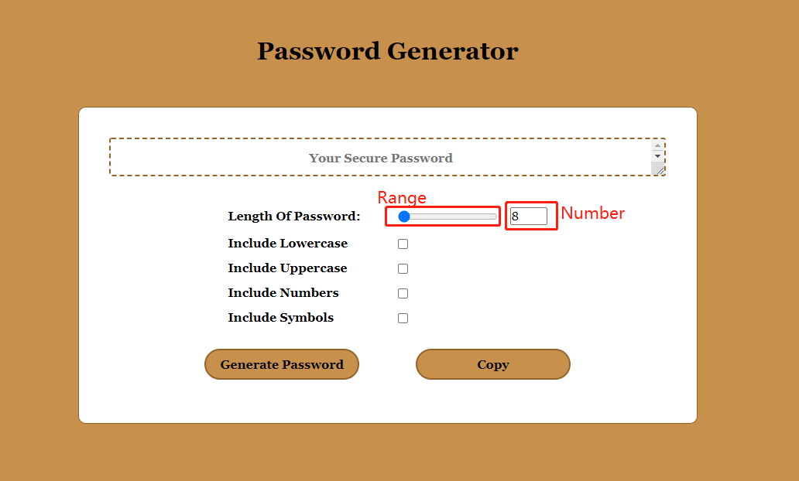
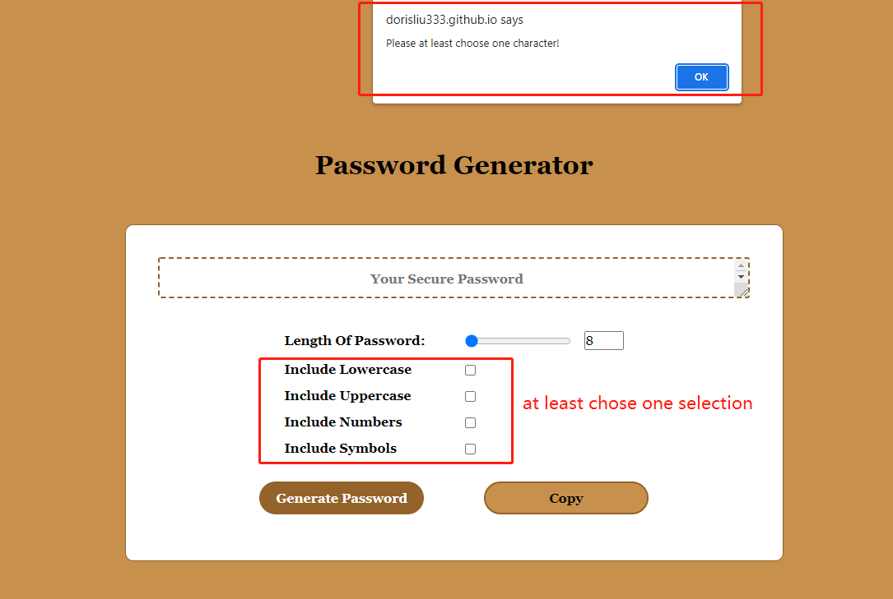
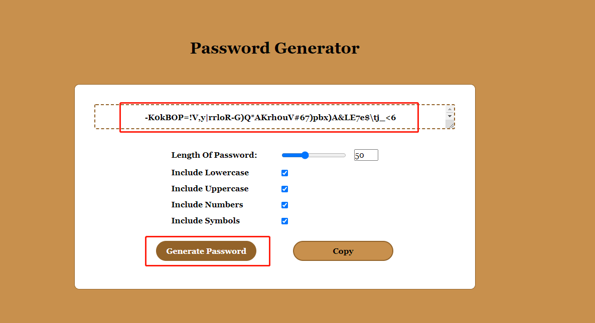
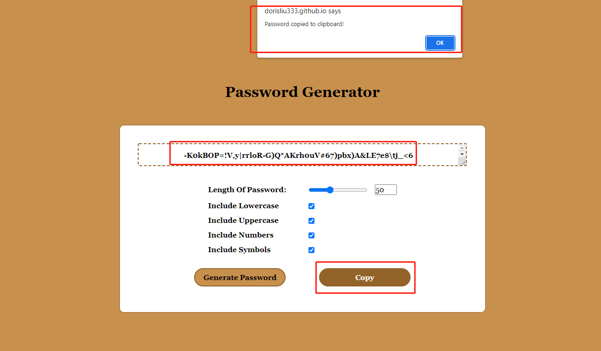
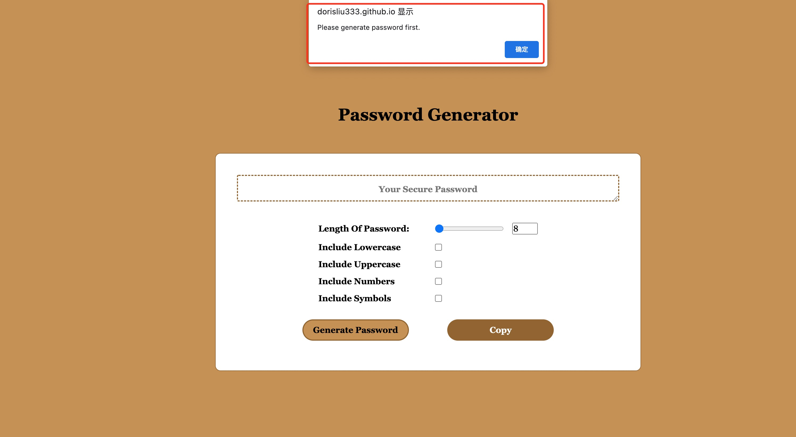
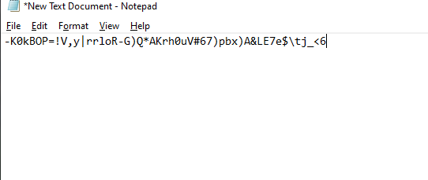

## password_generator_advanced
create an application that enable to generate random passwords based on criteria that users' selected. So users can a strong password based on their choices that provides greater security.

* When user open the page, user can see password display area, selection of password, generated password button and copy button

*  The length of the password would be 8-128, if you move the range, the number will show the number of the range. Also, if you type the number in the number box, the range will reflect the number

*  User needs to chose at least one selection, if user do't chose any selection, it will alert to the user to remind 

* After user chose what character they want to include in the password, then press the generate button, the password will show in the display area

* When user want to copy the password which just generated, press the copy button, will alert that the password has been copied to the clipboard. If there's no password generated, will alert that generated password first

* Then user can paste where it needs the password
  

## Deployed URL:
https://dorisliu333.github.io/password_generator_advanced_chujunliu/